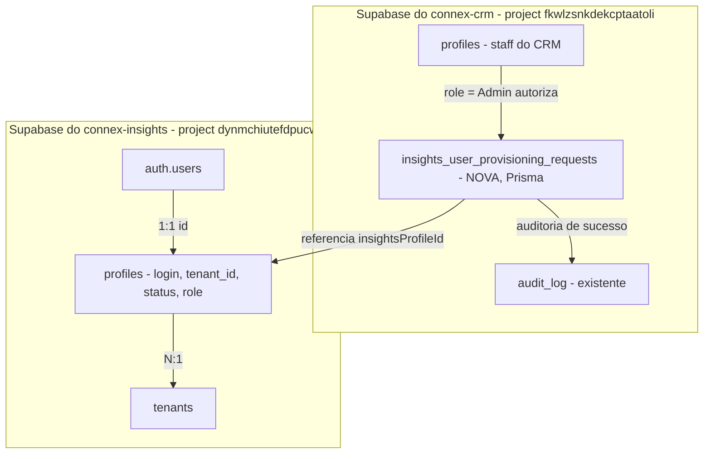

# Data Model: Provisionamento de Usuários do Connex Insights via CRM

**Feature**: `002-provisionamento-usuarios-insights`
**Data**: 2026-07-22

## Visão Geral



Esta feature introduz **uma única tabela nova**, de propriedade do `connex-crm`, migrada via Prisma. Todas as demais entidades referenciadas (`tenants`, `profiles`, `auth.users` do Connex Insights) são **externas**: lidas/escritas via `@supabase/supabase-js` (Service Role), nunca migradas pelo CRM. Ver [research.md § D1](./research.md#d1-onde-os-modelos-prisma-e-as-migrations-devem-viver).

---

## Entidade nova (propriedade do connex-crm, Prisma)

### `insights_user_provisioning_requests`

Registro de cada tentativa de provisionamento de usuário para o Connex Insights — serve simultaneamente como **guarda de idempotência** (constraints únicas) e **trilha de auditoria** (nunca é deletada; apenas transita de status).

| Campo | Tipo | Constraints | Descrição |
|---|---|---|---|
| `id` | `UUID` | PK, `@default(uuid())` | Identificador da requisição |
| `requestedByProfileId` | `UUID` | NOT NULL | `profiles.id` do admin do CRM que criou a requisição (FK para `profiles` do próprio CRM) |
| `insightsTenantId` | `UUID` | NOT NULL | `tenants.id` do Connex Insights (referência somente informativa; não há FK física entre bancos) |
| `insightsTenantNameSnapshot` | `TEXT` | NOT NULL | Nome do tenant no momento da criação (evita nova consulta cross-DB para exibir histórico) |
| `name` | `TEXT` | NOT NULL | Nome do usuário final |
| `email` | `TEXT` | NOT NULL, UNIQUE | E-mail de contato informado |
| `login` | `TEXT` | NOT NULL, UNIQUE | Identificador de login distinto do e-mail (ver Impacto Cross-Repo no `spec.md`) |
| `status` | `ENUM` | NOT NULL, DEFAULT `PENDING` | `PENDING` \| `SUCCEEDED` \| `FAILED_DUPLICATE` \| `FAILED_ERROR` |
| `insightsAuthUserId` | `UUID` | NULL | Preenchido após criação bem-sucedida no Supabase Auth do Insights |
| `insightsProfileId` | `UUID` | NULL | Preenchido após `INSERT` bem-sucedido em `profiles` do Insights (= `insightsAuthUserId`) |
| `temporaryPasswordIssued` | `BOOLEAN` | NOT NULL, DEFAULT `false` | Marca que uma senha temporária foi exibida ao admin; **nunca** armazena a senha em si |
| `failureReason` | `TEXT` | NULL | Motivo textual sanitizado (sem detalhes internos) quando `status` é `FAILED_*` |
| `createdAt` | `TIMESTAMPTZ` | NOT NULL, DEFAULT `now()` | Data da tentativa |
| `updatedAt` | `TIMESTAMPTZ` | NOT NULL | Última transição de status |

**Índices**:
- PK em `id`
- UNIQUE em `email`
- UNIQUE em `login`
- INDEX em `(insightsTenantId, createdAt DESC)` — listagem por tenant

**Regras de validação** (na camada Zod, antes de qualquer escrita):
- `name`: 2–120 caracteres.
- `email`: formato RFC 5322 simplificado.
- `login`: 3–40 caracteres, `^[a-z0-9._-]+$` (minúsculo, sem espaços), normalizado para lowercase antes de persistir.
- `insightsTenantId`: deve existir na lista de tenants lida em tempo real do Connex Insights (validação de existência no servidor, não apenas no client).

**Transições de estado**:

```text
PENDING --(Auth + profiles OK)--> SUCCEEDED
PENDING --(constraint única violada em qualquer camada)--> FAILED_DUPLICATE
PENDING --(erro de rede/infra/DB)--> FAILED_ERROR
```

Não há transição de saída de `SUCCEEDED`, `FAILED_DUPLICATE` ou `FAILED_ERROR` — o registro é imutável a partir daí (apenas novas requisições são criadas para novas tentativas, mesmo que o e-mail/login tenha sido corrigido).

**RLS** (habilitado por exigência da Constituição do CRM, Princípio X):
- SELECT: `requestedByProfileId = auth.uid()` OR papel do usuário autenticado (join com `profiles` do CRM) = `Admin`.
- INSERT: somente quando papel do usuário autenticado = `Admin`.
- UPDATE: somente via Service Role (transições de status são feitas pelo próprio Route Handler, nunca pelo cliente) — nenhuma policy de UPDATE para `authenticated`.
- DELETE: proibido para todos os papéis (tabela append-only, mesma filosofia do `audit_log` da Constituição).

> **Nota de enforcement**: estas policies protegem contra acesso direto e fora da
> aplicação (ex.: chave de serviço vazada, acesso via Supabase Studio, `supabase-js`
> com JWT de usuário). As queries do próprio Route Handler via Prisma Client usam um
> papel Postgres privilegiado (necessário para `prisma migrate`) e **não são filtradas
> por estas policies** — a autorização de aplicação (`role === 'Admin'`, `tasks.md` T015)
> é a linha de defesa primária para esses acessos. Ver `research.md` § D8.

**Prisma (ilustrativo — detalhes finais na fase de tasks/implementação)**:

```prisma
enum ProvisioningStatus {
  PENDING
  SUCCEEDED
  FAILED_DUPLICATE
  FAILED_ERROR
}

model InsightsUserProvisioningRequest {
  id                          String             @id @default(uuid()) @db.Uuid
  requestedByProfileId        String             @map("requested_by_profile_id") @db.Uuid
  insightsTenantId            String             @map("insights_tenant_id") @db.Uuid
  insightsTenantNameSnapshot  String             @map("insights_tenant_name_snapshot")
  name                        String
  email                       String             @unique
  login                       String             @unique
  status                      ProvisioningStatus @default(PENDING)
  insightsAuthUserId          String?            @map("insights_auth_user_id") @db.Uuid
  insightsProfileId           String?            @map("insights_profile_id") @db.Uuid
  temporaryPasswordIssued     Boolean            @default(false) @map("temporary_password_issued")
  failureReason               String?            @map("failure_reason")
  createdAt                   DateTime           @default(now()) @map("created_at") @db.Timestamptz(6)
  updatedAt                   DateTime           @updatedAt @map("updated_at") @db.Timestamptz(6)

  @@index([insightsTenantId, createdAt(sort: Desc)])
  @@map("insights_user_provisioning_requests")
}
```

---

## Entidades externas (somente leitura/escrita via `supabase-js`, propriedade do connex-insights)

Documentadas aqui apenas como **contrato de consumo** — a fonte de verdade do esquema é `connex-insights/specs/001-user-auth/data-model.md`.

### `tenants` (leitura)

| Campo consumido | Uso nesta feature |
|---|---|
| `id` | Valor persistido em `insights_user_provisioning_requests.insightsTenantId` e enviado no `INSERT` de `profiles` |
| `name` | Exibido no seletor de tenant do formulário e no dashboard |

### `profiles` (leitura para contadores/listagem; escrita para criação)

| Campo consumido/escrito | Uso nesta feature |
|---|---|
| `id` | = `auth.users.id` do usuário recém-criado |
| `tenant_id` | Associação obrigatória (FR-012) |
| `display_name` | Recebe `name` do formulário |
| `role` | Sempre `MEMBER` para usuários criados por esta feature |
| `status` | Sempre `INACTIVE` na criação (RN já herdada de `connex-insights/specs/002`) |
| `login` **(coluna nova, dependência cross-repo — ver spec.md)** | Recebe `login` do formulário; `UNIQUE`, `NOT NULL` |
| `created_at` / `updated_at` | Preenchidos pelo próprio Postgres do Insights |

### `auth.users` (escrita via Admin API)

- Criado via `admin.auth.admin.createUser({ email, password, email_confirm: true, app_metadata: { tenant_id, status: 'INACTIVE' } })`, no mesmo padrão de `connex-insights/prisma/seed.ts`.
- Compensação (`admin.auth.admin.deleteUser`) se o `INSERT` em `profiles` falhar — ver [research.md § D2](./research.md#d2-atomicidade-da-criação-auth-admin-api--insert-em-profiles).

---

## Mensagens de Erro (UI)

Tabela de referência para o texto exibido ao admin em cada cenário de falha (FR-016, FR-017, SEC-004). Usada por `CreateUserErrorModal.tsx` (`tasks.md` T052) e pela implementação de erros do Route Handler (T049). Nenhuma mensagem abaixo expõe nomes de tabela, stack trace, ou menção a Prisma/Supabase.

| Status HTTP | Gatilho | Texto exibido ao admin |
|---|---|---|
| `400` | Payload inválido (Zod) | "Verifique os campos destacados e tente novamente." + erros inline por campo |
| `401` | Sessão ausente/expirada | "Sua sessão expirou. Faça login novamente." |
| `403` | Usuário autenticado não é `Admin` | "Você não tem permissão para criar usuários do Connex Insights." |
| `404` | Tenant selecionado não existe mais no Connex Insights | "O tenant selecionado não foi encontrado. Atualize a lista e tente novamente." |
| `409` | E-mail ou login já em uso (local ou remoto) | "Já existe um usuário com este e-mail ou login. Verifique os dados e tente novamente." |
| `502` | Falha de comunicação com o Connex Insights | "Não foi possível concluir a criação no momento. Tente novamente em instantes." |

**Regra geral**: nenhuma mensagem desta tabela deve ser alterada para incluir detalhes internos (nome de tabela, mensagem de exceção do Postgres/Prisma, stack trace) — ver testes de sanitização em `tasks.md` T041/T042.

---

## Entidade de UI (não persistida): `Aplicação`

Usada apenas para renderizar o hub `/aplicacoes`; não requer tabela — lista estática no código (`lib/constants/aplicacoes.ts`) com um item funcional (`connex-insights`) e demais itens `disponivel: false`.

| Campo | Tipo | Descrição |
|---|---|---|
| `slug` | `string` | Identificador de rota, ex. `connex-insights` |
| `nome` | `string` | Nome exibido |
| `descricao` | `string` | Texto curto |
| `icone` | `LucideIcon` | Ícone do card |
| `disponivel` | `boolean` | Controla se o card é clicável |
