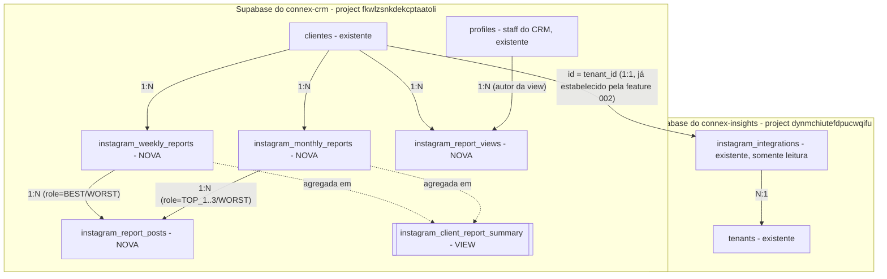

# Data Model: Visualização de Relatórios do Instagram no Connex CRM

**Feature**: `003-relatorios-instagram-crm`
**Data**: 2026-07-26

## Visão Geral

Todas as quatro tabelas novas (`instagram_weekly_reports`, `instagram_monthly_reports`, `instagram_report_posts`, `instagram_report_views`) e a view (`instagram_client_report_summary`) são de propriedade do `connex-crm`, migradas via SQL puro em `supabase/migrations/` (ver [research.md § D1](./research.md#d1-onde-persistir-os-relatórios-recebidos)). Nenhuma tabela do `connex-insights` é migrada por este plano; `instagram_integrations` é lida remotamente, somente leitura (ver [research.md § D3](./research.md#d3-fonte-dos-dados-de-statususernameavatar-do-instagram-exibidos-no-card-do-cliente)).

---

## Entidades novas (propriedade do connex-crm)

### `instagram_weekly_reports`

Um relatório semanal recebido do Connex Insights para um cliente, já com melhor/pior postagem definidas.

| Campo | Tipo | Constraints | Descrição |
|---|---|---|---|
| `id` | `UUID` | PK, `DEFAULT gen_random_uuid()` | Identificador do relatório no CRM |
| `cliente_id` | `UUID` | NOT NULL, FK → `clientes(id)` ON DELETE CASCADE | Cliente ao qual o relatório pertence |
| `source_report_id` | `TEXT` | NOT NULL, UNIQUE | Identificador do relatório no Connex Insights — chave de idempotência da ingestão |
| `reference_year` | `SMALLINT` | NOT NULL | Ano do período de referência |
| `reference_month` | `SMALLINT` | NOT NULL, CHECK (1–12) | Mês do período de referência |
| `reference_week` | `SMALLINT` | NOT NULL, CHECK (1–5) | Posição ordinal da semana dentro do mês de referência, definida pelo Insights (não calculada pelo CRM — FR-027) |
| `period_start` | `DATE` | NOT NULL | Início do período coberto pelo relatório |
| `period_end` | `DATE` | NOT NULL | Fim do período coberto pelo relatório |
| `generated_at` | `TIMESTAMPTZ` | NOT NULL | Data/hora em que o Connex Insights gerou/enviou o relatório |
| `status` | `TEXT` | NOT NULL, DEFAULT `'AVAILABLE'`, CHECK (`AVAILABLE`,`PARTIAL`) | `PARTIAL` quando o Insights envia o relatório com campos faltantes (ex.: sem pior postagem) |
| `created_at` | `TIMESTAMPTZ` | NOT NULL, DEFAULT `now()` | — |
| `updated_at` | `TIMESTAMPTZ` | NOT NULL, DEFAULT `now()` (trigger `moddatetime`) | Atualizado em caso de reingestão (upsert por `source_report_id`) |

**Índices**: PK em `id`; UNIQUE em `source_report_id`; UNIQUE em `(cliente_id, reference_year, reference_month, reference_week)`; INDEX em `(cliente_id, reference_year DESC, reference_month DESC)` para a listagem de meses (FR-010).

---

### `instagram_monthly_reports`

Um relatório mensal recebido do Connex Insights para um cliente, com top 3 postagens, pior postagem, seguidores e alcance.

| Campo | Tipo | Constraints | Descrição |
|---|---|---|---|
| `id` | `UUID` | PK, `DEFAULT gen_random_uuid()` | — |
| `cliente_id` | `UUID` | NOT NULL, FK → `clientes(id)` ON DELETE CASCADE | — |
| `source_report_id` | `TEXT` | NOT NULL, UNIQUE | Chave de idempotência da ingestão |
| `reference_year` | `SMALLINT` | NOT NULL | — |
| `reference_month` | `SMALLINT` | NOT NULL, CHECK (1–12) | — |
| `generated_at` | `TIMESTAMPTZ` | NOT NULL | — |
| `status` | `TEXT` | NOT NULL, DEFAULT `'AVAILABLE'`, CHECK (`AVAILABLE`,`PARTIAL`) | — |
| `followers_gained` | `INTEGER` | NULL | Seguidores ganhos no período |
| `followers_start` | `INTEGER` | NULL | Seguidores no início do período (quando disponível) |
| `followers_end` | `INTEGER` | NULL | Seguidores no final do período (quando disponível) |
| `followers_growth_pct` | `NUMERIC(6,2)` | NULL | Crescimento percentual (quando disponível) |
| `accounts_reached` | `INTEGER` | NULL | Contas alcançadas no período |
| `created_at` | `TIMESTAMPTZ` | NOT NULL, DEFAULT `now()` | — |
| `updated_at` | `TIMESTAMPTZ` | NOT NULL, DEFAULT `now()` (trigger `moddatetime`) | — |

**Índices**: PK em `id`; UNIQUE em `source_report_id`; UNIQUE em `(cliente_id, reference_year, reference_month)`; INDEX em `(cliente_id, reference_year DESC, reference_month DESC)`.

---

### `instagram_report_posts`

Uma postagem referenciada dentro de um relatório (semanal ou mensal), com papel definido pelo Insights.

| Campo | Tipo | Constraints | Descrição |
|---|---|---|---|
| `id` | `UUID` | PK, `DEFAULT gen_random_uuid()` | — |
| `report_type` | `TEXT` | NOT NULL, CHECK (`WEEKLY`,`MONTHLY`) | Discrimina a qual tabela de relatório a postagem pertence |
| `weekly_report_id` | `UUID` | NULL, FK → `instagram_weekly_reports(id)` ON DELETE CASCADE | Preenchido apenas quando `report_type = 'WEEKLY'` |
| `monthly_report_id` | `UUID` | NULL, FK → `instagram_monthly_reports(id)` ON DELETE CASCADE | Preenchido apenas quando `report_type = 'MONTHLY'` |
| `role` | `TEXT` | NOT NULL, CHECK (`BEST`,`WORST`,`TOP_1`,`TOP_2`,`TOP_3`) | Papel definido pelo Insights — nunca calculado pelo CRM (FR-027) |
| `instagram_media_id` | `TEXT` | NOT NULL | ID da postagem no Instagram (rastreabilidade) |
| `permalink` | `TEXT` | NULL | Link público da postagem |
| `thumbnail_url` | `TEXT` | NULL | — |
| `content_type` | `TEXT` | NULL | Tipo de conteúdo (ex.: `IMAGE`, `VIDEO`, `CAROUSEL`, `REELS`) — valor livre definido pelo Insights |
| `published_at` | `TIMESTAMPTZ` | NULL | Data de publicação no Instagram |
| `primary_metric_name` | `TEXT` | NULL | Nome da métrica de performance usada para o ranking (ex.: `engagement`) |
| `primary_metric_value` | `NUMERIC` | NULL | Valor da métrica de performance |
| `metrics` | `JSONB` | NOT NULL, DEFAULT `'{}'` | Demais métricas disponibilizadas pelo Instagram (engajamento, alcance, impressões, curtidas, comentários, compartilhamentos, salvamentos, visualizações, outras) — ver [research.md § D4](./research.md#d4-modelagem-das-postagens-dentro-dos-relatórios) |
| `created_at` | `TIMESTAMPTZ` | NOT NULL, DEFAULT `now()` | — |
| `updated_at` | `TIMESTAMPTZ` | NOT NULL, DEFAULT `now()` (trigger `moddatetime`) | — |

**Constraints adicionais**:
- `CHECK`: `(report_type = 'WEEKLY' AND weekly_report_id IS NOT NULL AND monthly_report_id IS NULL) OR (report_type = 'MONTHLY' AND monthly_report_id IS NOT NULL AND weekly_report_id IS NULL)`.
- `UNIQUE INDEX` parcial `(weekly_report_id, role) WHERE weekly_report_id IS NOT NULL` — no máximo uma postagem por papel (`BEST`/`WORST`) por relatório semanal.
- `UNIQUE INDEX` parcial `(monthly_report_id, role) WHERE monthly_report_id IS NOT NULL` — no máximo uma postagem por papel (`TOP_1`/`TOP_2`/`TOP_3`/`WORST`) por relatório mensal.

---

### `instagram_report_views`

Rastreia a última vez que cada usuário do CRM visualizou os relatórios de um cliente — usada exclusivamente para o indicador de "novos relatórios" (FR-004).

| Campo | Tipo | Constraints | Descrição |
|---|---|---|---|
| `id` | `UUID` | PK, `DEFAULT gen_random_uuid()` | — |
| `user_id` | `UUID` | NOT NULL, FK → `profiles(id)` ON DELETE CASCADE | Usuário do CRM |
| `cliente_id` | `UUID` | NOT NULL, FK → `clientes(id)` ON DELETE CASCADE | — |
| `last_viewed_at` | `TIMESTAMPTZ` | NOT NULL, DEFAULT `now()` | Atualizado a cada visita à página do cliente |
| `created_at` | `TIMESTAMPTZ` | NOT NULL, DEFAULT `now()` | — |
| `updated_at` | `TIMESTAMPTZ` | NOT NULL, DEFAULT `now()` (trigger `moddatetime`) | — |

**Índices**: PK em `id`; UNIQUE em `(user_id, cliente_id)`.

---

### `instagram_client_report_summary` (VIEW, `security_invoker = true`)

Agrega `instagram_weekly_reports` e `instagram_monthly_reports` por cliente, para alimentar a listagem paginada (FR-003) e a ordenação por período de referência mais recente (FR-018) sem duplicar essa lógica em múltiplos repositories.

| Campo | Descrição |
|---|---|
| `cliente_id` | — |
| `last_report_reference_date` | `MAX` entre `period_end` (semanais) e o último dia do mês de referência (mensais) |
| `last_generated_at` | `MAX(generated_at)` entre os dois tipos |
| `has_weekly_reports` | `BOOLEAN` — existe ao menos 1 relatório semanal |
| `has_monthly_reports` | `BOOLEAN` — existe ao menos 1 relatório mensal |

---

## Entidade externa (somente leitura, connex-insights)

### `instagram_integrations` (Insights)

Já existente e migrada pelo `connex-insights` — **não é tocada por este plano**. Lida em lote via `ConnexInsightsRemoteRepository` (Service Role), filtrando `tenant_id IN (<ids da página atual de clientes>)`.

| Campo relevante | Uso no CRM |
|---|---|
| `tenant_id` | Chave de junção — igual a `clientes.id` (estabelecido pela feature 002) |
| `username` | Exibido no card e no header da página do cliente |
| `profile_picture_url` | Avatar exibido no card e no header |
| `status` (`CONNECTED`\|`DISCONNECTED`\|`REQUIRES_RECONNECTION`) | Badge de status no card — mapeado por `switch` exaustivo no frontend (Constitution II) |

---

## Validação (Zod, na camada de ingestão — antes de qualquer escrita)

- `clienteId`: UUID válido; deve existir em `clientes` (senão, `404`).
- `sourceReportId`: string não vazia, única por natureza do upsert.
- `referenceYear`: inteiro, 2020–2100.
- `referenceMonth`: inteiro, 1–12.
- `referenceWeek` (somente semanal): inteiro, 1–5.
- `periodStart`/`periodEnd` (somente semanal): datas ISO 8601, `periodStart <= periodEnd`.
- `generatedAt`: datetime ISO 8601.
- `status`: `"AVAILABLE" | "PARTIAL"`.
- `bestPost`/`worstPost` (semanal) e `topPosts[0..2]`/`worstPost` (mensal): objetos opcionais (podem faltar em relatórios `PARTIAL`, conforme edge case da spec), cada um validado como `PostPayload` (`instagramMediaId` obrigatório se o objeto existir; demais campos opcionais).
- `followersGained`/`followersStart`/`followersEnd`/`accountsReached` (mensal): inteiros ≥ 0, opcionais.
- `followersGrowthPct` (mensal): número, opcional.

A validação **não** reinterpreta nem recalcula nenhum valor — apenas garante forma e tipo, preservando FR-027.

## Transições de estado

Os registros de relatório são **essencialmente imutáveis** após a criação: a única "transição" possível é uma **reingestão idempotente** pelo mesmo `source_report_id` (upsert), usada quando o Insights reenvia o mesmo relatório com dados corrigidos/completados (ex.: de `PARTIAL` para `AVAILABLE`). Não há exclusão via aplicação (sem soft delete necessário — não há fluxo de exclusão nesta spec); limpeza, se necessária no futuro, é operação administrativa direta no banco.

## RLS (Row Level Security)

| Tabela | SELECT | INSERT/UPDATE | DELETE |
|---|---|---|---|
| `instagram_weekly_reports` | `auth.role() = 'authenticated'` | Nenhuma policy para `authenticated` — apenas via Service Role no endpoint de ingestão (D11) | Nenhuma |
| `instagram_monthly_reports` | `auth.role() = 'authenticated'` | idem | Nenhuma |
| `instagram_report_posts` | `auth.role() = 'authenticated'` | idem | Nenhuma |
| `instagram_report_views` | `user_id = auth.uid()` | INSERT/UPDATE `WITH CHECK (user_id = auth.uid())` — o próprio usuário registra sua visualização | Nenhuma |

Nenhuma policy usa `tenant_id`/`org_id` — conforme clarificado no `spec.md` (SEC-002/SEC-003), o Connex CRM não possui conceito de tenant.
